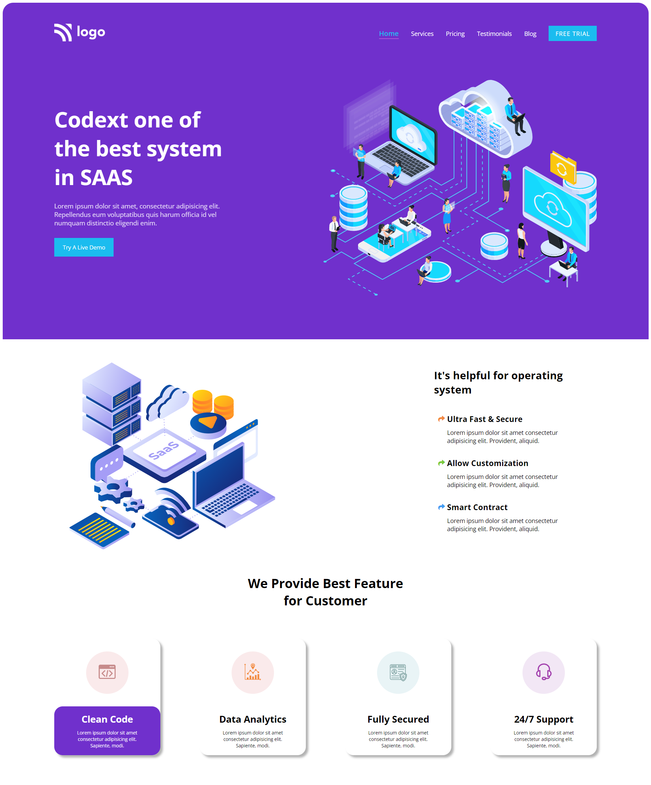

# Business Landing Page

## :link: [See it live](https://fullstack-js-bc-project-13.netlify.app/)

## :clipboard: Learning Outcomes 

- Learnt to change the **svg** colors with the use of `fill` and `stroke` CSS properties
- Learnt the application of `box-shadow` to cards
## :camera: Screenshot

